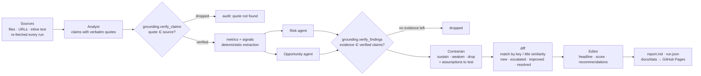
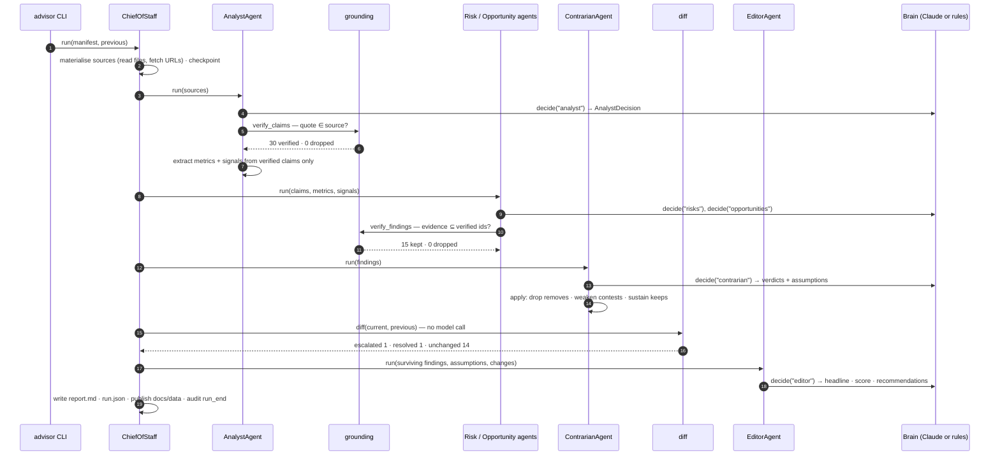
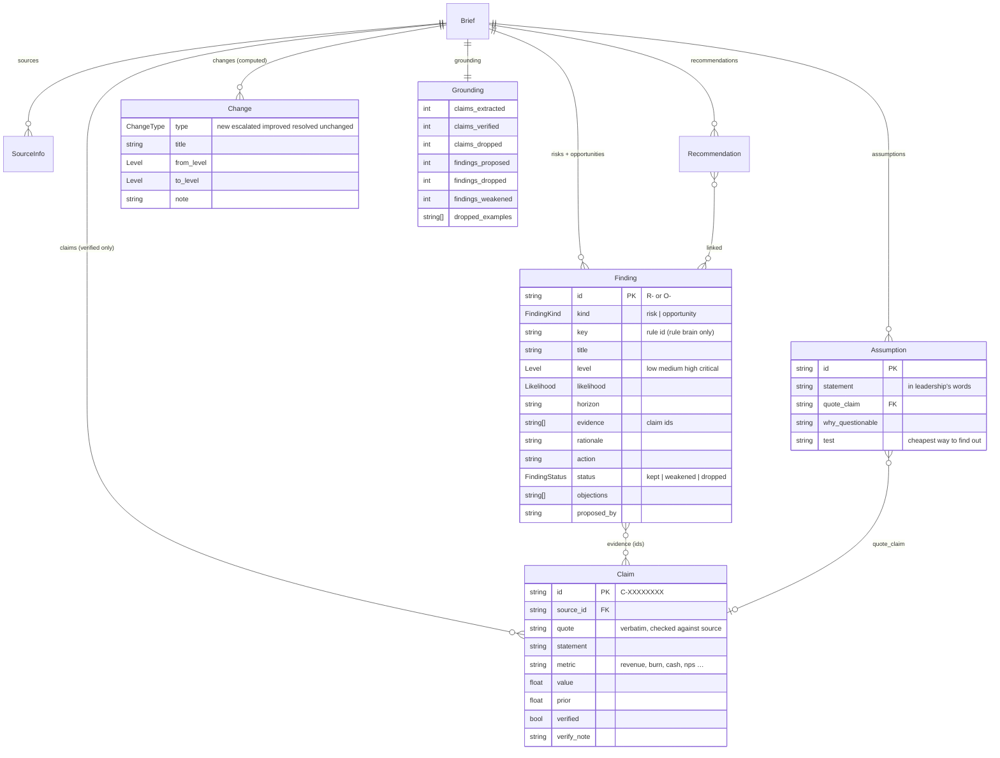

# Executive Advisor

[](https://github.com/AbdulAlharbi/exec-advisor/actions/workflows/ci.yml)
[](pyproject.toml)
[](tests/)
[](LICENSE)

A multi-agent AI advisor that reads a company's business information — financial closes, pipeline notes, incident logs, board memos, customer feedback, live spreadsheets — and produces an executive brief: risks, opportunities, the assumptions leadership is treating as facts, ranked recommendations with owners and timelines, and what changed since last time. Five specialist agents are sequenced by a **Chief of Staff** orchestrator. Every claim an agent makes must carry a verbatim quote that a program confirms exists in the named source; a **Contrarian** agent that may only attack reviews every finding before it reaches the executive; and change detection is computed by matching findings across runs, never by asking the model what it thinks changed. Reasoning is pluggable — Claude via the Anthropic Messages API, or a deterministic rule brain behind the same interface — so the whole pipeline and its test suite run offline with no API key. It runs on a GitHub Actions schedule and publishes to GitHub Pages, so "continuous" needs no server.



The workflow was chosen because it is what a board member or chief of staff actually does — and because the failure mode of an LLM doing it is silent: a fluent brief with an invented number in it is worse than no brief. That makes it a real test of the hard problem in AI advisory: not whether a model can write recommendations, but whether every sentence it writes can be traced to something true.

---

## Requirements → design decisions

The brief: continuously analyse business information, identify risks and opportunities, challenge assumptions, and give executives actionable recommendations. Decomposed:

| Requirement | Design decision | Why | Proof |
|---|---|---|---|
| **Every finding is traceable to a source** — no invented numbers | The Analyst returns `ClaimSpec`s with a verbatim `quote` and `source_id`. `grounding.verify_claims()` checks, in code, that the normalised quote is a substring of the named source. Findings may only cite verified claim ids; `verify_findings()` strips unknown ids and drops findings left with none. The gate is called *by the agents*, after every brain decision; the prompt cannot reach it. | A prompt-level rule ("cite your sources") is advice. A substring check every claim must pass is a control. A hallucinated figure becomes a dropped claim in the audit log, not a line in the brief. | `grounding.py:46` `verify_claims`, `:66` `verify_findings`, `agents/analyst.py:21`, `agents/findings.py:32` · `tests/test_grounding.py` — exact quote passes, curly quotes and whitespace tolerated, paraphrase / altered number / wrong source / short quote each dropped · `tests/test_pipeline.py:87` `test_grounding_gate_stops_a_hallucinating_brain` runs a brain that invents a quote, mis-attributes a real one and cites a fake claim id, and asserts all three are removed and the half-grounded finding survives with only its real evidence · `:32` asserts every evidence id in a real run resolves to a quote present in its source |
| **Challenge assumptions** — the advisor must argue with itself, not just summarise | A separate `ContrarianAgent` runs after the findings agents. It may **not** add findings; it returns one verdict per finding — `sustain`, `weaken`, `drop` — and a list of leadership assumptions, each quoting leadership's own words via a claim id, with the cheapest test to settle it. Verdicts are applied structurally: `drop` removes the finding, `weaken` marks it contested and excludes it from the health score. | An agent that can only subtract cannot be talked into agreeing. Splitting proposer and critic across separate calls is what makes "challenge" a step rather than a sentence in a prompt. | `agents/contrarian.py:12`, `llm/claude.py:46` ("You may NOT add findings"), `llm/heuristic.py:325` · `tests/test_heuristic.py:21` — an expansion backed by a "verbal yes" is weakened, a finding with no evidence is dropped, and the "just paperwork" assumption is surfaced · `tests/test_pipeline.py:19` asserts the demo company's expansion opportunity is `weakened` in week 1 |
| **Change detection is computed, not narrated** | `diff.py` matches findings across runs by a stable `key` when both sides carry one (the rule brain sets rule ids) and otherwise by Jaccard similarity of title tokens (threshold 0.4), then compares levels: `new`, `escalated`, `improved`, `resolved`, `unchanged`. The Editor is shown the computed changes; it is never asked "what changed?". | Asking the model to diff two documents produces plausible narrative, including changes that did not happen. Structural matching produces a list that can be wrong only in ways a test can catch. | `diff.py:35` `match`, `:57` `diff`, `chief_of_staff.py:108` · `tests/test_diff.py` — key match beats rewording, similarity matches escalation without keys, new/resolved/improved, dropped findings ignored, kinds never cross-match · `tests/test_pipeline.py:57` runs the week-1 and week-2 snapshots and asserts DSO escalated `medium → high`, the renewal risk resolved, the expansion's contrarian objection was lifted, and **nothing** was reported as new |
| **Two interchangeable brains** | `ClaudeBrain` and `HeuristicBrain` implement `Brain.decide(task, context, schema) → schema`. `ADVISOR_BRAIN=auto` picks Claude when `ANTHROPIC_API_KEY` is set, the rule brain otherwise. The brain that made each decision is recorded per phase (`Brief.decided_by`). | The rule brain is the floor the model must beat, the CI back-end, the offline demo, and the production fallback. Identical agent code either way. | `llm/base.py:19` `Brain`, `:25` `make_brain`, `config.py:39` `resolve_brain` · every test in `tests/test_pipeline.py` runs the full pipeline on the rule brain (`conftest.py` sets `brain = "heuristic"`); `tests/test_claude_brain.py` covers the Claude path with a stubbed client |
| **LLM output is a typed proposal, never a side effect** | Agents call `brain.decide(...)` and get back a validated pydantic object (`AnalystDecision`, `FindingsDecision`, `ContrarianDecision`, `EditorDecision`). Claude's reply is unwrapped from prose or fences and validated; a failure is fed back once for repair; after two failures or any API error the rule brain answers and the fallback is recorded in `decided_by` and the audit log. | Validation before state change means a malformed reply is a parse error, not a recommendation. The workflow never stalls on the model. | `models.py` decision schemas, `llm/claude.py:91` `decide` (2 attempts then fallback at `:113`), `agents/base.py:32` `decided_by` · `tests/test_claude_brain.py` — plain JSON, fenced JSON with prose, `test_repairs_invalid_output_once` asserts `client.calls == 2`, two failures and an API exception both fall through to the heuristic with `last_error` set |
| **Continuous, without a server** | Sources are a YAML manifest of files, URLs and inline text; URLs are re-fetched on every run. `.github/workflows/advisor.yml` runs the pipeline on a cron, commits `docs/data/{latest,index,history/*}.json` plus `docs/data/audit.jsonl`, and GitHub Pages serves `docs/index.html`, which renders the committed JSON. | A static site cannot hold a key, so the analysis runs in Actions and the site only reads. The audit log is published into `docs/data` and restored before each run, so the hash chain continues across scheduled runs. | `sources.py:55` `materialise`, `chief_of_staff.py:132` `publish`, `.github/workflows/advisor.yml`, `docs/index.html` · `tests/test_pipeline.py:43` asserts `latest.json`, `index.json` and `history/<run>.json` are written with the right run id; `:98` a dead URL is recorded as an error and the run completes on the remaining sources; `:111` all-sources-dead terminates cleanly |
| **Tamper-evident audit** | Every source fetch, brain decision, grounding result, contrarian verdict count, diff summary, phase transition and publish is one JSON line whose SHA-256 covers the previous line's hash. `advisor audit` walks and verifies the chain. | An executive trusting an autonomous advisor needs an after-the-fact record that cannot be quietly edited — including the record of what the model *tried* to say and had removed. | `audit.py:38` `record`, `:57` `verify` · `tests/test_audit.py` rewrites one payload field and asserts `verify()` flips to false at that entry; `tests/test_pipeline.py:43` asserts a valid chain with more than 15 entries after a run |
| **Actionable, owned recommendations** | `EditorDecision.recommendations` requires `owner`, `timeline`, `expected_outcome` and `linked` finding ids; links to dropped findings are pruned. The rule brain keys every recommendation to the rule that produced the risk. | "Consider improving reliability" is not a recommendation. A role, a date and a measurable outcome are. | `models.py` `RecommendationSpec`, `agents/editor.py`, `llm/heuristic.py:38` `RULE_RECS` · `tests/test_pipeline.py:19` asserts every recommendation has an owner and a timeline |

---

## Quick start

```bash
git clone https://github.com/AbdulAlharbi/exec-advisor && cd exec-advisor
python -m venv .venv && source .venv/bin/activate
pip install -e ".[dev]"

advisor sources                                              # check the demo company's sources load
advisor run --brain heuristic                                # week-1 snapshot, rule brain, no key needed
advisor run --brain heuristic --sources data/company-week2/sources.yaml   # week 2: diffed against week 1
pytest -q                                                    # 42 tests, ~1s, no network
advisor audit                                                # print the trail, verify the hash chain
open docs/index.html                                         # the dashboard, reading docs/data/
```

`make install` / `make test` / `make demo` / `make audit` wrap the same commands. With `ANTHROPIC_API_KEY` set, `ADVISOR_BRAIN=auto` (the default) selects Claude; without it, the rule brain. Copy `.env.example` to `.env`.

### What a run looks like

Two snapshots of the bundled demo company, two weeks apart, on the rule brain (real output, this repo — run ids are random):

```
┃ run          ┃ at               ┃ brain     ┃ health ┃ posture ┃ headline                                                                ┃
│ RUN-3408615B │ 2026-09-05 04:53 │ heuristic │ 11     │ alarm   │ Cash runway is roughly 8 months at current burn. 3 critical and 7 high  │
│              │                  │           │        │         │ risks are live; 3 opportunities.                                        │
│ RUN-B16E8D30 │ 2026-09-05 04:53 │ heuristic │ 18     │ alarm   │ Cash runway is roughly 7 months at current burn. 3 critical and 7 high  │
│              │                  │           │        │         │ risks are live; 3 opportunities.                                        │
```

The second run's change table — computed by `diff.py`, not written by a model:

```
┃ type      ┃ kind        ┃ finding                                                                        ┃ note                                    ┃
│ escalated │ risk        │ Collections slowing: DSO 79 days from 48                                       │ medium → high                           │
│ resolved  │ risk        │ A key renewal is being forecast on a relationship that no longer exists        │ no longer present (was high)            │
│ unchanged │ opportunity │ A large expansion is on the table                                              │ still high; contrarian objection lifted │
│ unchanged │ opportunity │ Customers can quantify the savings the product delivers                        │ still medium                            │
│ unchanged │ opportunity │ Inbound demand is rising; conversion is the fixable bottleneck                 │ still high                              │
```

Between the snapshots the company signed the expansion it had been forecasting on a verbal yes (so the contrarian's objection lifts), the new decision-maker at the at-risk account took the meeting (so the renewal risk resolves), DSO moved from 71 to 79 days (so collections escalates), and a fourth outage was logged (reliability was already critical). Nothing is reported as new, because nothing new appeared.

Every finding in the report prints the quotes it rests on, with the source and the claim id, followed by the contrarian's verdict (`out/reports/RUN-B16E8D30.md`, abridged):

```
### Top customer is 36% of ARR
*severity: critical · likelihood: likely · horizon: this quarter · status: kept*

Single-customer share is 36%, up from 19%. Losing or renegotiating that account moves the whole plan.
The same customer holds a contractual exit right.

**Reduce it:** Cap the single-customer share of ARR in the plan and put a second-account expansion programme behind it

Evidence:
- "Top customer concentration: Kestrel Retail = 36% of ARR (was 19% in Q4). Next largest: Harlow Foods 9%,
  Dunmore Logistics 7%." — *Q2 financial summary* (`C-6F4ADE56`)
- "SLA credits issued in August: $212k. The Kestrel contract has a termination-for-convenience clause triggered
  by 3 SLA breaches in any rolling 90 days. This was the third." — *Operations incident log* (`C-629FA3E2`)
- ⚠ contrarian (sustain): Evidence is consistent across sources.
```

And the assumptions section quotes leadership back to itself:

```
### "Runway is comfortably above 12 months"
> "Net burn: $1.9M/month (Q1: $1.3M). Cash on hand: $13.1M. Board deck says runway is "comfortably above 12 months"."

On the numbers in the same document, $13.1M of cash at $1.9M per month is about 6.9 months — not 'comfortably above 12'.

**Test it:** Rebuild the cash forecast on current burn with unsigned expansion excluded; compare to the board deck figure.
```

---

## Configuration

Everything is resolved from the environment at `Settings()` construction (`config.py`), with CLI flags overriding.

| Variable | Default | Effect |
|---|---|---|
| `ANTHROPIC_API_KEY` | unset | Consumed by the `anthropic` SDK. Its presence is what makes `ADVISOR_BRAIN=auto` resolve to `claude`. |
| `ADVISOR_BRAIN` | `auto` | `auto` \| `claude` \| `heuristic`. |
| `ADVISOR_MODEL` | `claude-sonnet-5` | Model id passed to `ClaudeBrain`. Ignored by the rule brain. |
| `ADVISOR_SOURCES` | `data/company/sources.yaml` | The source manifest. Point it at your own company. |
| `ADVISOR_OUT_DIR` | `<repo>/out` | `runs/`, `reports/`, `audit.jsonl`. |
| `ADVISOR_SITE_DIR` | `<repo>/docs` | Where `publish()` writes `data/` for the dashboard. |
| `ADVISOR_FETCH_TIMEOUT` | `20` | Seconds per URL source. |
| `ADVISOR_MAX_SOURCE_CHARS` | `60000` | Sources longer than this are truncated and flagged. |

The substantive configuration is the **source manifest**:

```yaml
context: >
  One paragraph the advisor should know: stage, strategy, what the board cares about this quarter.
sources:
  - id: q2-financials
    title: Q2 financial summary
    path: q2-financials.md                       # relative to the manifest
  - id: pipeline-sheet
    title: Live pipeline (published Google Sheet)
    url: https://docs.google.com/spreadsheets/d/e/…/pub?output=csv   # re-fetched every run
  - id: voice-note
    title: CEO voice-note transcript
    text: |
      inline text works too
```

---

## Usage

### `advisor run`
One full pass: ingest → analyst → risks / opportunities → contrarian → diff → editor → report → publish. Diffs against the latest previous run in `out/runs/` by default.

```bash
advisor run                                                   # auto brain, default manifest
advisor run --brain heuristic --no-show                        # quiet, deterministic
advisor run --sources ./mycompany/sources.yaml --out ./mine    # your company, separate output dir
advisor run --previous RUN-3408615B                            # diff against a specific run
advisor run --no-publish                                       # don't touch docs/data
```

### `advisor show [run-id]` · `advisor history`
Print a brief (default: latest) or list every run with health, posture and headline.

### `advisor audit [run-id]`
Print the trail, optionally for one run, and verify the hash chain — `chain valid · 51 entries` after the two demo runs.

### `advisor sources [--sources path]`
Load every source in a manifest and report chars and errors, without running the pipeline.

### One run, in sequence



---

## Architecture

### Domain model (`models.py`)

Everything an agent produces is a typed pydantic object. Three kinds of thing exist: **sources** (what was read), **claims** (atomic statements with a verbatim quote), and **findings** (risks and opportunities that cite claims). Assumptions cite claims too. The brief is the container.



Four further schemas exist only as *what the brain is asked to return* — `AnalystDecision`, `FindingsDecision`, `ContrarianDecision`, `EditorDecision` — validated first, then mapped into the domain objects by the agents.

### Chief of Staff (`chief_of_staff.py`)

The orchestrator. Owns the phase sequence, checkpoints the brief to `out/runs/<run>.json` after every phase, computes the diff, writes the report and publishes the site data. It never calls a brain and never bypasses the grounding gate — the agents apply it; the orchestrator records what survived into `Brief.grounding`. If every source is empty or fails to load it terminates with `No readable sources.` rather than analysing nothing.

### Agents (`agents/`)

| Agent | Task | Given | Returns | Gate applied |
|---|---|---|---|---|
| **Analyst** | `analyst` | full source texts | `ClaimSpec[]` — quote, source id, statement, optional metric/value/prior | `verify_claims` — then metrics and signals are extracted from **verified claims only** |
| **Findings** ×2 | `risks`, `opportunities` | verified claims, metrics, signals | `FindingSpec[]` — title, level, likelihood, horizon, evidence ids, rationale, action | `verify_findings` — unknown evidence ids stripped, empty findings dropped |
| **Contrarian** | `contrarian` | findings, claims, metrics, signals | `Objection[]` (sustain / weaken / drop) + `AssumptionSpec[]` | may not add; verdicts applied structurally; `quote_claim` must be a verified id |
| **Editor** | `editor` | surviving findings, assumptions, computed changes | headline, summary, posture, score, recommendations, questions, gaps | links to dropped findings pruned |

Every agent goes through `BaseAgent.decide`, which records the decision — agent, task, brain, any fallback error, and a size summary of the output — in the audit log before the agent touches it.

**Metrics and signals** (`signals.py`) are the hinge between the two brains. Deterministic regexes over verified claim lines produce named metrics with value, prior and unit (`revenue`, `gross_margin`, `burn`, `cash`, `concentration`, `dso`, `nps`, `headcount`, `deferred_revenue`, `sla_credits`, `lead_conversion`, …) and named signals with the claim ids that fired them (`outage`, `termination_clause`, `resignation`, `champion_left`, `verbal_only`, `burnout`, `hedge_runway`, `hedge_control`, …). For the rule brain they are the whole input; Claude gets them as hints alongside the raw claims. Either way, every metric and signal carries the claim id it came from, so anything built on them stays traceable to a verified quote.

### Brain interface (`llm/`)

```python
class Brain(Protocol):
    name: str
    def decide(self, task: str, context: dict, schema: type[T]) -> T: ...   # validated pydantic
```

- **`ClaudeBrain`** (`llm/claude.py`) — Anthropic Messages API, `temperature=0.1`, per-task system prompts, `schema.model_json_schema()` embedded, context JSON truncated at 120 000 chars. Replies are unwrapped from prose or code fences and validated; one repair round on failure; then heuristic fallback with the error recorded on `last_error`, which `BaseAgent.decided_by` turns into `heuristic (fallback after ValidationError)` in the brief.
- **`HeuristicBrain`** (`llm/heuristic.py`) — explicit rules over the same metrics and signals. Runway = cash ÷ burn, critical under 9 months; concentration ≥ 25 % is high, critical if up more than 30 % on prior; two or more outages is high, critical if a termination clause is in play; NPS down ≥ 10, margin down ≥ 3 pts, burn up ≥ 25 %, DSO up ≥ 30 % (≥ 60 % high); and so on. The contrarian rules weaken any opportunity resting on a verbal commitment and turn hedge language ("comfortably above", "under control", "just paperwork", "growing pains") into assumptions with a computed rebuttal. The editor's health score is `100 − Σ severity weights + Σ uncontested opportunity weights`, clamped 5–95, and posture follows the score. Deterministic, dependency-free, and the reason CI and the demo need no key.

### Grounding (`grounding.py`)

Matching normalises whitespace, case, typographic quotes and dashes, so a model that copies correctly is never punished for a curly apostrophe — but a paraphrase, an altered digit, or a quote attributed to the wrong source fails. Quotes under 12 characters are rejected as too short to be meaningful evidence. The gate is 60 lines with no configuration; there is deliberately no "fuzzy" mode.

### Change detection (`diff.py`)

Findings are matched across runs first by `key` (rule id) when both sides have one, else by Jaccard similarity of their title tokens after stop-word removal, greedy best-match above 0.4. Matched pairs compare `level` → escalated / improved / unchanged; unmatched current → new; unmatched previous → resolved. Dropped findings are invisible on both sides. A status flip on an unchanged finding (`weakened → kept`) is noted as "contrarian objection lifted".

### Audit (`audit.py`)

Append-only JSONL, each entry's SHA-256 over its payload and the previous hash. Events: `run_start`, `source`, `decision`, `grounding`, `signals`, `contrarian`, `diff`, `phase`, `run_end`, `publish`. The scheduled workflow restores the chain from `docs/data/audit.jsonl` before a run and publishes it back after, so it persists across runs in Actions even though `out/` is gitignored.

### Landing page and dashboard (`docs/index.html`, `docs/app.html`)

`docs/index.html` is a static explainer — the problem, the pipeline, the grounding gate, the demo company and its computed diff, an honest "verified / not verified" split, and how to run it — with buttons into the live dashboard. `docs/app.html` is the dashboard itself.

A single static page, no framework, no build. It reads `data/index.json` for the run list and `data/latest.json` or `data/history/<run>.json` for a brief, and renders: the verdict and score, a "how this brief was made" strip (claims verified / dropped, findings dropped / contested, which brain decided each phase, what it was diffed against), the computed changes, every finding with its verified quotes and the contrarian's verdict behind a disclosure, assumptions quoting leadership, recommendations, questions, gaps, and what was left on the cutting-room floor. Nothing runs in the browser.

---

## Deploying the continuous loop

1. Push to GitHub. **Settings → Pages → Source: Deploy from a branch → `main` / `/docs`.** The site opens on the landing page (`docs/index.html`); the **Open the live brief** button leads to the dashboard (`docs/app.html`).
2. Optionally add `ANTHROPIC_API_KEY` under **Settings → Secrets and variables → Actions**. Without it the scheduled run uses the rule brain.
3. The `advisor` workflow runs every six hours (or on demand from the Actions tab, with a manifest and brain of your choosing), commits the new brief into `docs/data/`, and Pages redeploys.

To point it at a real company, replace `data/company/sources.yaml` — or keep the demo and add your own manifest, then set `ADVISOR_SOURCES` as a repository variable or pass it to the manual workflow.

---

## Demo company

Meridian Freight Systems, a fictional Series B logistics SaaS, in two snapshots (`data/company/`, `data/company-week2/`). Five sources: the Q2 close, a CRO pipeline note, an incident log, a CEO memo to the board, and a customer-feedback digest. The sources were written to contain the kind of tension real board packs contain — revenue up 18 % while margin, burn, DSO, deferred revenue and NPS all worsen; a top customer at 34 % of ARR who also holds a termination right that the third outage just triggered; a $3.6M expansion forecast as Commit on a verbal yes; a renewal forecast at 90 % after the champion left — and a CEO memo that calls it the best quarter ever and says the platform team has it under control.

Week-1 result on the rule brain: **13 risks** (3 critical: runway ≈ 8 months, concentration, reliability + termination right), **3 opportunities** (expansion weakened by the contrarian, core value weakened as qualitative), **8 assumptions**, health **11 / alarm**. Week 2: the expansion signs, the renewal recovers, DSO worsens, a fourth outage lands — and the diff says exactly that.

---

## Testing

42 tests, no network, no API key, about a second.

```
$ pytest -q
..........................................                               [100%]
42 passed in 1.16s
```

**Unit — `tests/test_grounding.py` (7).** The gate, case by case: exact quote passes; curly quotes and run-on whitespace tolerated; paraphrase, altered number, wrong source and short quote each dropped with the right note; a finding with one real and one fake evidence id keeps the real one and records the strip, a finding with only fake evidence is dropped.

**Unit — `tests/test_signals.py` (10).** Metric extraction parametrised over the demo lines — `$1.9M/month (Q1: $1.3M)`, `down from $5.3M`, `from 11% to 6%`, `$212k`, `34% of ARR (was 19% in Q4)`, `71 days (Q1: 48)` — plus a check that metrics and signals carry the claim id they came from and that `burnout` does not fire the `burn` metric.

**Unit — `tests/test_diff.py` (6).** Key match beats rewording; title similarity catches an escalation without keys; new / resolved / improved in one diff; dropped findings ignored; risks never match opportunities; similarity symmetric and bounded.

**Unit — `tests/test_audit.py` (2).** Chain verifies; editing one payload field breaks it at that entry; a reopened log continues the chain.

**Unit — `tests/test_heuristic.py` (4).** Runway rule computes months and cites both claims; silent when healthy; contrarian weakens a verbal expansion and drops an unevidenced finding; editor score bounded with posture consistent.

**Unit — `tests/test_claude_brain.py` (6).** Stubbed client, `pytest.importorskip("anthropic")`: plain JSON; fences and prose stripped; invalid output triggers exactly one repair (`calls == 2`); two failures and an API exception both fall back to the heuristic with `last_error` set; `extract_json` rejects non-JSON.

**Integration — `tests/test_pipeline.py` (7).** The whole pipeline on the rule brain against the fixture company:
- `test_week1_reads_the_company_correctly` — runway, concentration and reliability critical; alarm posture; runway in the headline; ≥ 5 assumptions; expansion weakened; zero claims or findings dropped; every recommendation has an owner and a timeline.
- `test_every_evidence_id_resolves_to_a_quote_that_exists_in_its_source` — re-reads the sources and checks every evidence id on every finding, independently of the gate.
- `test_artifacts_report_audit_and_publish` — run JSON, report containing the headline, valid audit chain > 15 entries, `latest.json` / `index.json` / `history/` written.
- `test_week2_changes_are_computed_not_narrated` — DSO escalated, renewal resolved, expansion objection lifted, nothing new.
- `test_grounding_gate_stops_a_hallucinating_brain` — a `FabricatingBrain` that invents a quote, mis-attributes a real one and cites a fake id: both bad claims dropped, the fabricated finding gone, the half-grounded finding kept with only its real evidence.
- `test_bad_source_is_recorded_not_fatal`, `test_all_sources_empty_terminates_cleanly`.

**CI** (`.github/workflows/ci.yml`) runs on every push and pull request on Python 3.11 and 3.12: `pytest -q`, then both demo snapshots end to end on the rule brain, then `advisor audit` — so a regression that keeps the tests green but breaks the pipeline still fails the build.

---

## Extending

### Add a rule to the heuristic brain

A rule is a condition over `metrics` / `signals`, a finding, and a recommendation template keyed by the rule id.

```python
# src/advisor/llm/heuristic.py — inside _risks()
if "lead_conversion" in m and m["lead_conversion"].prior and m["lead_conversion"].value < m["lead_conversion"].prior * 0.6:
    c = m["lead_conversion"]
    add("conversion", f"Lead conversion collapsed from {c.prior:g}% to {c.value:g}%", "high", [c.claim_id],
        "Conversion fell by more than 40% in one period; either the funnel or the offer broke.", horizon="30 days")

# RULE_RECS — the editor links this to the finding
"conversion": {"action": "Roll back the funnel change and A/B test forward", "owner": "VP Marketing",
               "timeline": "Two weeks", "expected_outcome": "Conversion back within 10% of prior"},
```

The `key` makes the finding matchable across runs by the diff engine. Claude's findings have no key and are matched by title similarity.

### Add a metric or signal

`signals.py` — a `(name, regex)` pair in `METRIC_LABELS` (more specific labels first) or `SIGNAL_PATTERNS`. Extraction is tested line by line in `tests/test_signals.py`; add the line you expect it to parse.

### Add a source type

`sources.py:materialise` — add a `kind` branch that fills `Source.text`. Everything downstream is text; the grounding gate works on whatever you load.

### Use it on your company

```bash
mkdir -p ~/acme && cp data/company/sources.yaml ~/acme/
# edit the manifest: your files, your published sheets, your context paragraph
advisor run --sources ~/acme/sources.yaml --out ~/acme/out --site docs
```

---

## Project layout

```
src/advisor/
├── cli.py                 typer CLI: run · show · history · audit · sources
├── chief_of_staff.py      ChiefOfStaff orchestrator, BriefStore, publish()
├── grounding.py           verify_claims / verify_findings — the gate
├── diff.py                computed change detection
├── signals.py             deterministic metrics + signals over verified claims
├── audit.py               hash-chained JSONL audit log
├── report.py              Markdown report with quotes under every finding
├── sources.py             YAML manifest → files, URLs, inline text
├── models.py              domain models + the four decision schemas
├── config.py              Settings from environment variables
├── agents/
│   ├── base.py            BaseAgent.decide — audits every brain call
│   ├── analyst.py         sources → claims → gate → metrics/signals
│   ├── findings.py        claims → risks | opportunities → gate
│   ├── contrarian.py      sustain / weaken / drop + assumptions
│   └── editor.py          headline, score, recommendations, questions, gaps
└── llm/
    ├── base.py            Brain protocol, make_brain()
    ├── claude.py          ClaudeBrain — Messages API, validation, repair, fallback
    └── heuristic.py       HeuristicBrain — rules, RULE_RECS, contrarian rules, editor scoring
data/company/              demo company, week 1 (5 sources + manifest)
data/company-week2/        the same company two weeks later
docs/index.html            the landing page (GitHub Pages entry point)
├── docs/app.html          the live dashboard, linked from the landing page
docs/data/                 latest.json · index.json · history/  — written by advisor run
tests/                     42 tests across 7 files
.github/workflows/         ci.yml (tests + pipeline on 3.11/3.12) · advisor.yml (scheduled run + commit)
```

---

## Verified

- **The rule-brain path is fully exercised offline.** `pytest -q` → `42 passed in 1.16s`; both demo snapshots run end to end with `advisor run --brain heuristic`; `advisor audit` reports `chain valid · 51 entries` afterwards. All numbers, tables and report excerpts in this README come from those runs against this working tree.
- **The Claude path is contract-tested, not live-tested.** `tests/test_claude_brain.py` drives `ClaudeBrain` with a stubbed client and asserts JSON extraction, the single repair round and the heuristic fallback. No test makes a network call. Running the agents on Claude requires a live key and has not been exercised in CI; outputs are non-deterministic, which is why the rule brain is the CI back-end.
- **The demo company is fictional and hand-written** to contain the contradictions the system is meant to find. The grounding gate has been exercised against an adversarial brain in tests, not against a real model's hallucinations yet.

### Known gaps

- **Grounding is substring-exact.** A model that paraphrases a number correctly ("burn of $1.9M") is dropped along with one that invents it. That is the intended trade — false negatives are cheap, false positives are the failure mode — but a model that struggles to copy verbatim will produce thin briefs. The Analyst prompt is explicit about this; it has not been tuned against a live model.
- **Claude findings are matched by title similarity.** Two runs of Claude may word the same risk differently enough to fall under the 0.4 threshold, producing a spurious `resolved` + `new` pair. A fingerprint on evidence claim quotes (which are stable across runs) would be more robust than one on titles.
- **The health score is linear.** Fourteen medium risks and three critical ones score similarly. It is consistent and testable, not calibrated.
- **Single-manifest, single-timeline.** `BriefStore.latest()` picks the most recent run in `out/runs/` regardless of which manifest produced it; running two companies into one output directory will diff them against each other. Use separate `--out` directories.
- **No live-source cache.** A URL that fails on one scheduled run is simply absent from that brief; the diff will then report its findings as resolved. A "source unavailable — carrying forward" state would be more honest.

---

## Roadmap

- Evidence-based fingerprints for the diff engine, so Claude's findings match across runs by what they cite rather than how they are titled
- A replayed-brief evaluation set: run both brains on the same snapshots and score Claude against the rule floor on grounding rate, contrarian agreement and diff stability
- Per-source freshness windows and a carry-forward state for unavailable live sources
- An interactive challenge mode on the dashboard (bring-your-own-key, browser-direct) for executives who want to argue with a brief
- Calendar and CRM connectors as source kinds

## License

MIT — see [`LICENSE`](LICENSE).
